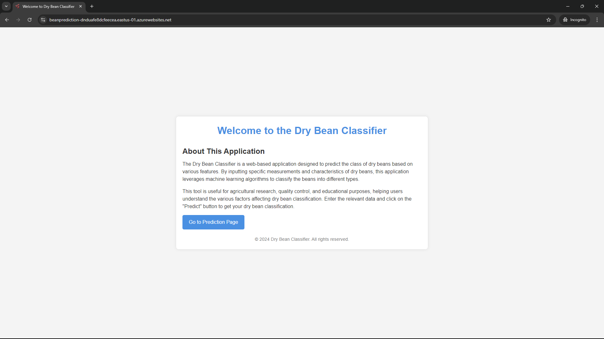
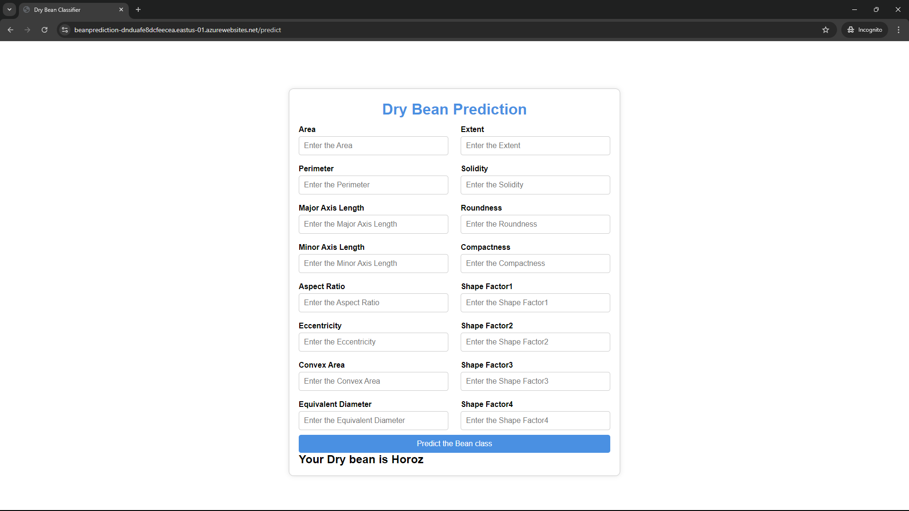

# Dry Bean Classification 🚀

This project is focused on the classification of different types of dry beans using a machine learning approach. The dataset consists of 16 feature columns and 1 target column "Class" with 7 unique classes. The project is implemented with several packages and tools to facilitate data preprocessing, model training, and evaluation.

Table of Contents
* Dataset
* Installation
* Usage
* Components
* Model Training
* Logging and Monitoring
* Contributing

## Dataset
The dataset used in this project includes the following features:
* Area
* Perimeter
* MajorAxisLength
* MinorAxisLength
* AspectRatio
* Eccentricity
* ConvexArea
* EquivDiameter
* Extent
* Solidity
* Roundness
* Compactness
* ShapeFactor1
* ShapeFactor2
* ShapeFactor3
* ShapeFactor4
* Class {
    * Seker
    * Barbunya
    * Bombay
    * Cali
    * Horoz
    * Sira
    * Dermason
}

The target column is Class and it has 7 unique classes.

## Installation & Requirements
To run this project, you need to install the following packages:
* mlflow
* jupyter
* scikit-learn
* pandas
* seaborn
* ucimlrepo
* xgboost
* imbalanced-learn
* Flask
* tqdm
* pydantic
* pylint
* matplotlib

## Setting up

### Clone the repository

```
git clone https://github.com/Jaykold/dry-bean-predictor.git
```

### Navigate to the project directory

```
cd dry-bean-predictor
```

### Create a virtual environment
You can install the required packages using the code provided below:

```
pip install -e .
```
Run this to install the required packages and project in editable mode.


## Components

#### Data Ingestion
The `data_ingestion.py` script is responsible for loading the dataset and performing initial data checks.

#### Data Preprocessing
The `data_preprocess.py` script handles data cleaning, feature engineering, and splitting the data into training and testing sets.

#### Model Training
The `model_trainer.py` script trains a classification model using the preprocessed data and evaluates its performance.

## Pipeline
The `pipeline` directory contains script for model prediction.
* `predict.py`

#### Model training
To train the model, run the `model_trainer.py` script:

```
python src/components/model_trainer.py
```

Or use the Makefile by typing ```make``` in your terminal

This will train the model and save the results to the `artifacts` directory.

If you are using windows you can install ```make``` by running this code in your terminal

```
Set-ExecutionPolicy Bypass -Scope Process -Force; [System.Net.WebClient]::new().DownloadString('https://community.chocolatey.org/install.ps1') | Invoke-Expression
```

then install make using choco

```
choco install make
```
On linux check if ```make``` is installed

```
make --version
```

if not installed, run

```
sudo apt update
sudo apt install make
```
.

To run app.py to predict your bean, use this code command

```
# On windows
waitress-serve --listen=0.0.0.0:9696 app:app
# On Linux
gunicorn --bind=0.0.0.0:9696 app:app
```

### Building and Running the Docker Container

To build and run the Docker container for the Dry Bean Prediction Service, follow these steps:

1. Build the Docker Image:
```
docker build -t dry-bean-prediction-service:v1 .
```
This command creates a Docker image named dry-bean-prediction-service with the tag v1. The . at the end specifies the current directory as the build context, which contains the Dockerfile and other necessary files.

2. Run the Docker Container:

```
docker run -it --rm -p 9696:9696 dry-bean-prediction-service:v1
```

This command runs the Docker container from the dry-bean-prediction-service:v1 image. The options used are:
* ```-it```: Runs the container in interactive mode with a terminal.
* ```--rm```: Automatically removes the container when it exits.
* ```-p 9696:9696```: Maps port 9696 on your local machine to port 9696 in the container, allowing you to access the service.

By following these steps, you can build and run the Dry Bean Prediction Service locally using Docker.

## Contributing
Contributions are welcome! Please open an issue or submit a pull request for any improvements or bug fixes.
